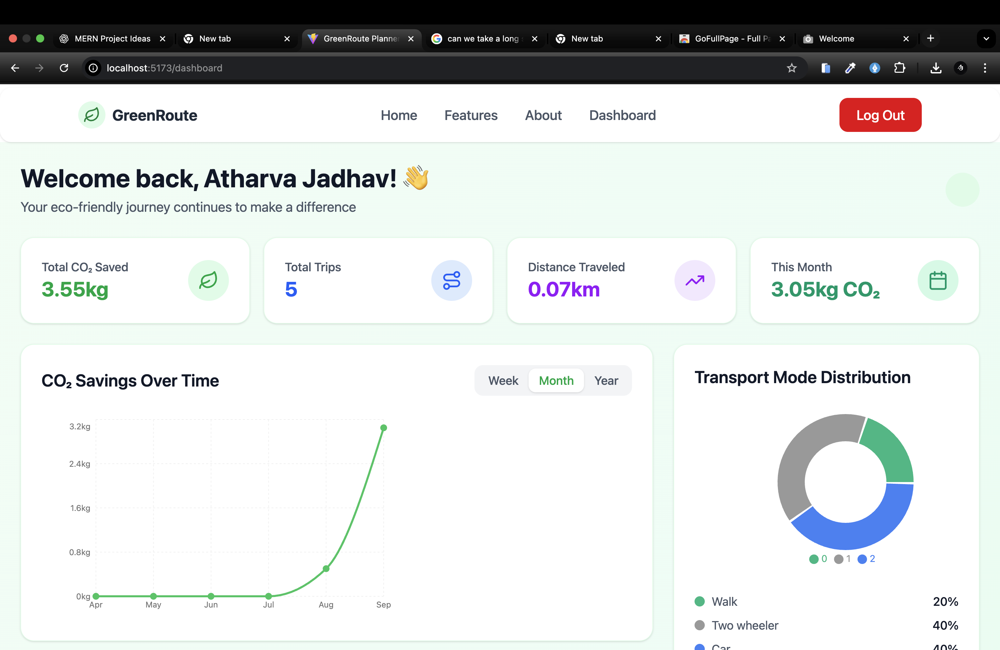
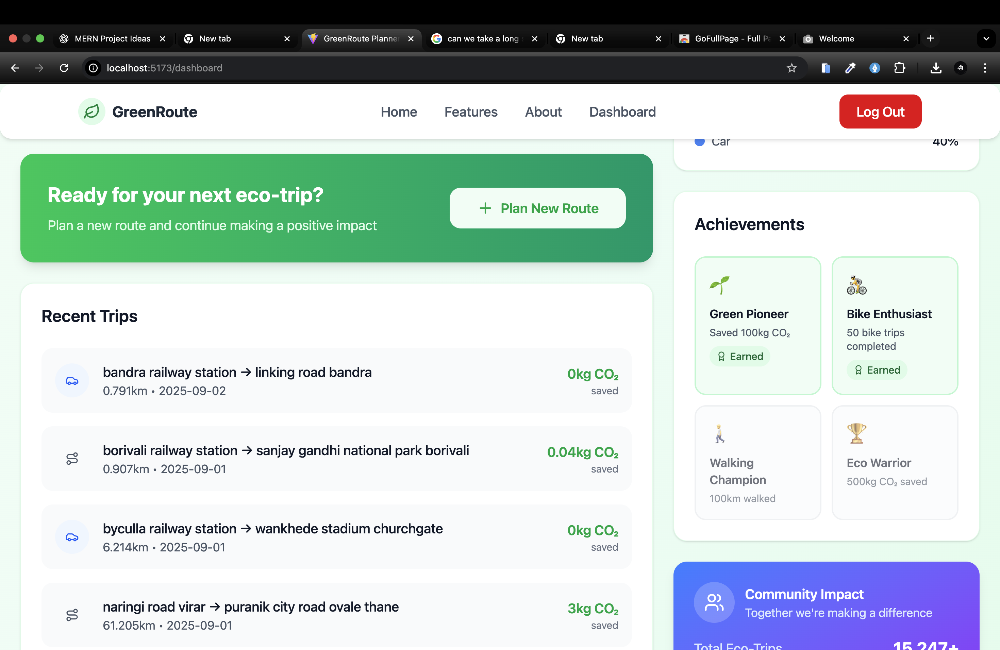

## GreenRoute 🌱 (Ongoing Project)

GreenRoute is an eco-friendly route planner in active development. It compares fastest vs low-carbon routes, estimates per-trip CO₂ emissions (using Climatiq) and uses OpenRouteService for routing. Key features — protected dashboard, trip history, and achievement badges — are being built incrementally.

The user dashboard temporarily looks like this:

